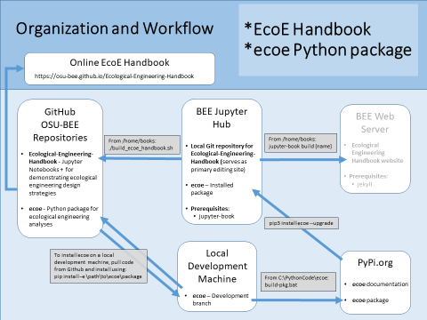
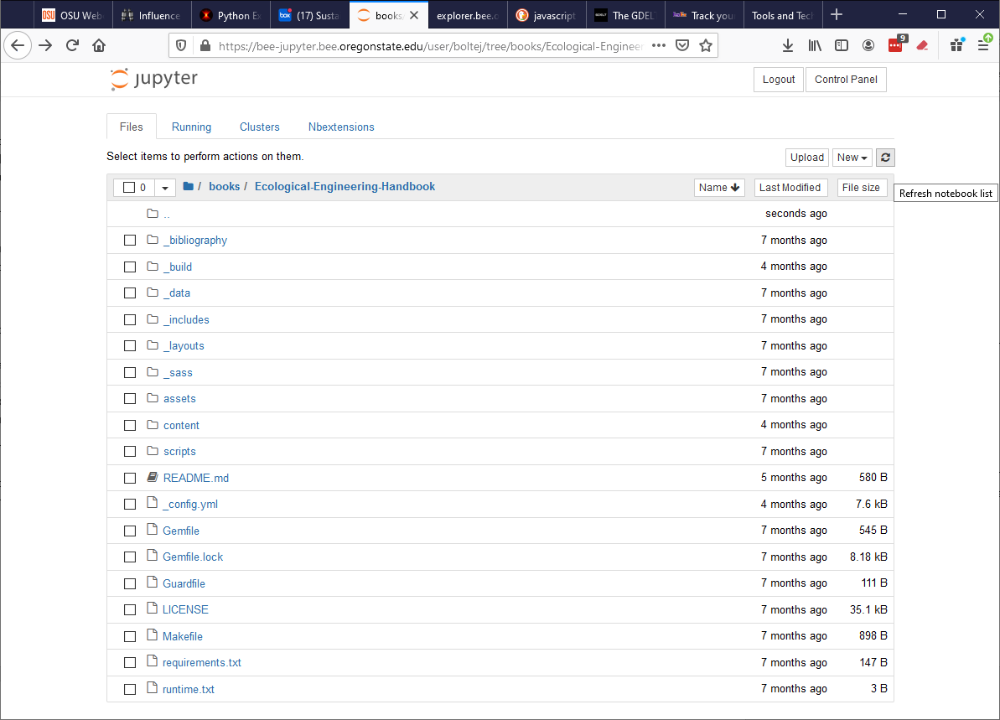

# Ecological Engineering Handbook – Guide to Contributing


## Table of Contents

[Overview – Ecological Engineering Handbook](#overview)

[Developing Content using BEE’s Jupyter Hub](#content_dev)

[   Prerequisites](#prereqs)

[   Folder Access on the BEE Jupyter Hub](#folder_access)
    
[   Creating/Editing Content Files](#content_editing)
   
[   Updating the Table of Contents](#content_toc)

[Publishing Revisions to the Ecological Engineering Handbook](#publish)


<a name="overview"></a>
## Overview – Ecological Engineering Handbook

This guide provides instructions for content providers for the Ecological Engineering Handbook.  This handbook “lives” in a public GitHub repository and is fully open-source.  It consists of a set of folders and files on GitHub, organized within a specific directory structure, that utilizes an open-source tool, jupyter-book, to generate the suite of HTML files that collective make up the Ecological Engineering Handbook.  The “source” files for the handbook content are of two types: 1) Markdown documents (.md extension) that are text files that use a simple markup language to specify text formatting (see https://www.markdownguide.org/ for more information on markdown syntax), and 2) Jupyter Notebooks (.ipynb extension, see https://jupyter.org/ for more information) that can contain Python code blocks in addition to markdown text.    

The source code and contents files for the Handbook “live” on GitHub, a widely used repository for open-source projects.  These files are not directly editable – rather, GitHub provides for centralized storage of projects and download/upload capabilities.  In generally working with a GitHub-hosted project involves downloading the project onto your local machine, making any edits, deletions, and/or additions to the project files, and uploading any changes back to the GitHub project repository.  When changes are detected in the Ecological Engineering Handbook source files, GitHub will automatically generate updated HTML files for the Ecological Engineering site and publish those updated files. 

Development of Jupyter Notebook-based content files requires a Jupyter server, many of which are available.  Oregon State University’s BEE Jupyter Hub is one such server, and currently hosts the Handbook content pages.  

This guide assumes contributors will develop content using BEE’s Jupyter Hub, but other alternative Jupyter development environments can be used.  


<a name="content_dev"></a>
## Developing Content using BEE’s Jupyter Hub

Elements of content development for the Handbook using BEE’s Jupyter Hub is provide below in Figure 1.  This approach involves: 1)  creating/editing content either as Jupyter notebooks and/or Markdown documents, 2) running a script available on the BEE Jupyter Hub to "push" the files back to the GitHub repository.



Figure 1. Elements of The Ecological Engineering Handbook/ecoe Python Package

<!-- #region -->
<a name="prereqs"></a>
### Prerequisites

Prerequisites for this pathway are: 

1. A login account with appropriate (read/write) permissions for accessing the BEE Jupyter Hub, including the `/home/books/Ecological-Engineering-Handbook` folder.

2. Knowledge of Jupyter Notebooks and markdown formatting.

<a name="folder_access"></a>
### Folder Access on the BEE Jupyter Hub

To start and editing session, log into the BEE Jupyter Hub (bee-jupyter.bee.oregonstate.edu) and navigate to the `/home/books/Ecological-Engineering-Handbook` folder.  If you don’t have read/write permissions to this folder, contact Randy Thorp (thorpr@oregonstate.edu).  It is convenient, but not necessary, to put a symbolic link to this directory in your personal home directory.  You should see a screen similar to the following:

 
This folder contains all the files necessary to update the Handbook.  The site uses the jupyter-book software to generate the Handbook; most of these folders are used only by jupyter-book and can be ignored.  Two folders, however, are of interest to content developers.  The first, the `content` folder, contain all content files on the site, organized in a directory structure that mirrors the Handbook’s content structure.  The second, the `_data` folder, contains a single file, `toc.yml`, that defines the Table of Contents (the left-hand-side navigation screen) for the published Handbook.

<a name="content_editing"></a>
### Creating/Editing Content Files

To create new content, first navigate (or create) the folder where the content will reside.  This **must** be located somewhere inside the `content` folder, and should be located in a folder structure consistent with the Table of Contents.  Content should be either a Markdown document (`*.md`) if only containing formatted text, or a Jupyter notebook (`*.ipynb`) for formatted text/Python code.  No "special" formatting of these files is necessary outside their normal conventions. These file can be created using the Jupyter Hub interface or any other tool supporting creation/editing of these files (e.g. Visual Studio Code, which is installed on the `bee-jupyter` machine.)

<a name="content_toc"></a>
### Updating the Table of Contents

The Table of Contents (the left hand side banner on the published Handbook) is defined in the `_data/toc.yml` file.  This is a simple structured text file, in “yaml” format (yaml is a very simple markup language).  The `toc.yml` file structure is self explanatory; new/modified entries should follow the format of the existing entries precisely.  Because this is a text file, it can be edited with any editor (e.g. Visual Studio Code or the Jupyter interface)


<a name="publish"></a>
## Publishing Revisions to the Ecological Engineering Handbook

After adding/modifying Handbook files on bee-jupyter, the modified files must be uploaded back to GitHub.  To do so, run the `/home/books/build_ecoe_handbook.sh` shell script.  This scripts looks for any modifications and uploads those modification to GitHub. To run this script, either remote desktop into `bee-jupyter` or start a terminal sesstion from within the Jupyter interface. Once uploaded, an automatic process on GitHub will “publish” the changes to the online Ecological Engineering Handbook (located at https://osu-bee.github.io/Ecological-Engineering-Handbook.

<!-- #endregion -->

```python

```
