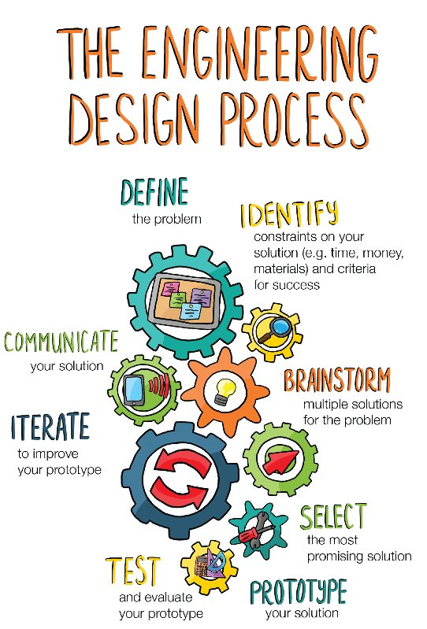
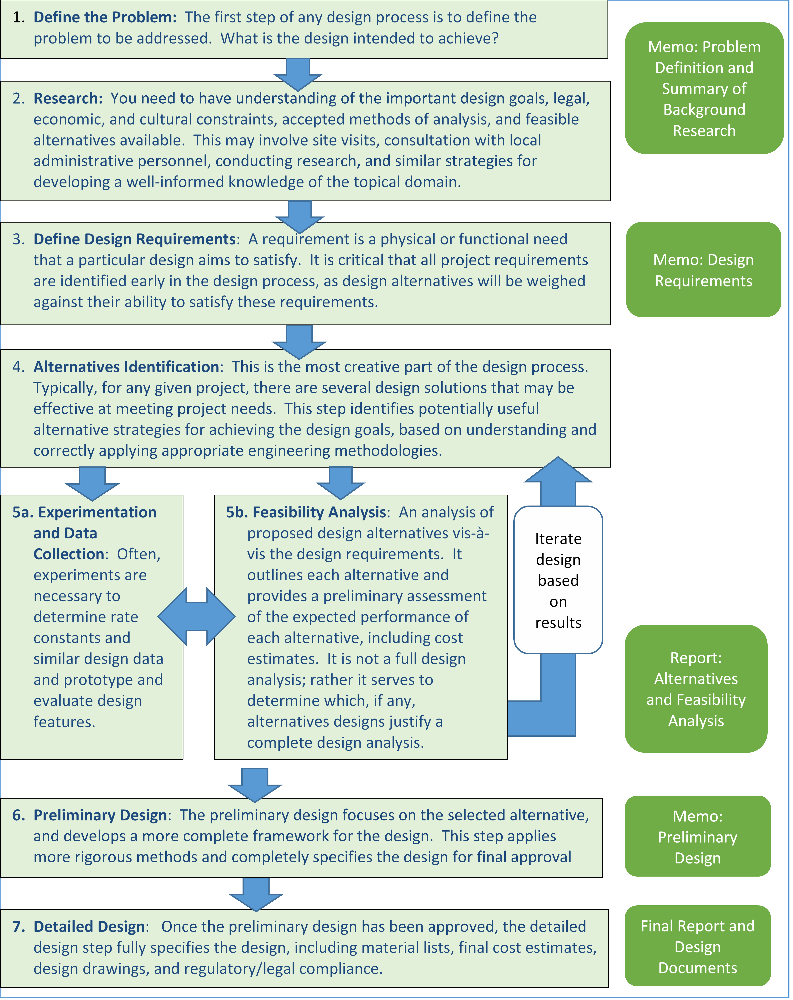

# Design Strategies for Ecological Engineering

Authors: John Bolte1 Gerrad Jones1, Desiree Tullos1, John Selker1

1Biological & Ecological Engineering Department, Oregon State University

[<a href='#DesignProcessSteps'>Design Process - Steps]</a>&nbsp;&nbsp;&nbsp;
[<a href='#Communication'>Communication and Documentation</a>]

## Fundamentals
Design is fundamental to the practice of ecological engineering.  Below, we provide some guidance on approaching design problems in ecological engineering, including a brief discussion of design process, a stepwise flowchart to identify key steps in the process, and guidelines for documentation produced at various steps in the process.  
Design is a creative process that identifies problems and constraints, develops solutions to overcome those constraints and address the problem in a cost-effective way.  These solutions should not only work, they must meet the needs of the client, be based on accepted engineering analyses and methods, consider economic, social, and ethical dimensions of the design, and be communicated to the client in an effective manner.

Ecological engineering designs often incorporate additional constraints related to sustainability, system resilience, and need to provide a variety of ecosystem services, the geospatial nature of many ecological engineering problems, and the intrinsic complexity and variability associated with ecological systems.

The figure to the right provides a nice general summary of the design process, identifying important steps and concepts.  Some of the key steps in this generalize design process are:

    </img>
    
    [from <a href='kqed.org/engineeringforgood'>kqed.org/engineeringforgood </a>]
    

1. **Define the Problem**. Clearly state the problem and begin to identify various physical, ecological, economic, legal, social, and ethical constraints.  Research the problem and identify appropriate engineering techniques to analyze possible solutions.  Take a look at other solutions to the problem (or similar challenges) and analyze why they work – or don’t work. Your goal is not to copy others’ work, but to try out different perspectives and gather information on a problem.  

2. **Identify Needs and Constraints.** Specify the requirements of the design as well as any constraints identified above.  Clearly state the assumptions that you are using to simplify the calculations you are using to generate your design (e.g., this design assumes steady state conditions). Establish basic cost guidelines (time and materials).  Understand legal requirements including permitting and other regulatory processes.  Work with the client to understand their goals and constraints.  Identify needs related to provision of ecosystem services.  

3. **Brainstorm.** Come up with possible ideas and solutions to the design challenge. Encourage creative, informed exploration of possible solutions, without getting excessively bogged down in detail.  Use drawings, sketches, or computer visualizations to help inform the process where appropriate. At the end of the session, pick a few (generally 3-5) alternatives that satisfy all the requirements and appear to be the best options for further analysis.  

4. **Select a Design.** Typically, this will involve the development of a decision matrix that specifies the key design features, weights these aspects in relative importance, and evaluates each option against all the selection criteria. As a team, share and discuss the ideas you are focusing on and develop a list of advantages and disadvantages for each design. The pros and cons could spur further ideas or refinements. Evaluate the feasibility of each alternative. Identify potential unintended consequences. This typically involves development of an alternatives analysis, based on specified design criteria (e.g. effectiveness, cost, environmental impact, uncertainty and risk of failure, etc.) Review results with the client.  Choose one design you want to move forward.  

5. **Prototype and Test.** Building a model – either physical or numerical – of your design based on your plans is a vital part of the engineering design process. Start by sketching the process you will use to achieve your design. Lay out each and every step of the process in terms of their sequence, expected time required, testing of the step.  Overall, the design process sketch should include time for testing, peer review, report development, and unanticipated delays. Typically, this will result in a Gantt chart or detailed calendar presentation of the engineering program. Your process will need to evaluate how your design meets the requirements and specifications for the project, including economic constraints and social suitability.  Does it respect relevant regulations and address community values and ownership?  Once you’ve identified your design and test process, develop your prototype and test it out. This step allows you to see potential flaws, opportunities, or challenges that aren’t obvious.  Refine your design to better meet the criteria and constraints. You may have to repeat this step several times, or you may have to go back to previous steps and start over. It is all part of the design process – there is no right or wrong way to go through this procedure.  

6. **Communicate.**  Document the design process, developing a series of engineering memos and communications with your client at key milestones in the design process, and at the end of the process collecting your results in a Final Report.

## Steps in the Design Process for Ecological Engineering

</img>

## Communicating and Documenting Your Design Process

From the first meeting with a client where a problem is defined, until the completion of your design process, you will be in frequent communication with your client.  Typically, this takes the form of a series of meetings/design charrettes and engineering memos and reports that provide clients with updates, review alternatives and get feedback and direction as the project proceeds.  

1. **Engineering Memos** are generally brief (1-2 pages) and provide summaries of information and request for information from the client. Follow <a href='Engineering-Memos.html'>this link</a> for information on the structure of a typical engineering memo.  An example engineering memo <a href='ExEngMemo.pdf'>is available here</a>
2. Engineer Reports as more in-depth documents generally addressing more technical aspects of a design.

This is one example of a design process used within Ecological Engineering.  Many variations exist, but all good design processes delineate specific steps in the process and the need to communicate and document the process.  These are general guidelines only; you should adapt these as needed to address specific needs and situations.

#### Problem Definition Memo

The Problem Definition memo defines the design problem and summarizes background information, and may suggest alternatives for consideration.  Some items typically addressed in this memo are provide below:

1.	A concise statement of your understanding of the design problem
2.	A concise statement of your understanding of the overall project goals
3.	A brief summary of similar projects that might provide examples of successful (or problematic) design features, legal, regulatory, economic, and social considerations, and other relevant background information.
4.	A request for additional information/feedback if needed

Example Problem Definition Memos:
- <a href='ExProbDefinitionMemo.pdf'>Example Needed!</a> 

#### Requirements Memo

This memo specifies the requirements and specifications for the design problem.  It identifies performance standards the design will need to meet, including legal, regulatory, economic and cultural constraints.  Items typically addressed in this memo are:

1.	Specific need(s) addressed by the design
2.	Performance standards for the project – what quantitative standards are relevant to the project, and how are they defined
3.	Legal, regulatory, economic and cultural constraints that will or could impact the project
4.	A request for additional information/feedback if needed

Example Requirements Memos:
- <a href='ExRequirements.pdf'>Example Needed</a> 

#### Alternatives and Feasibility Memo/Report

This report is often more substantial than a memo, and provides narrative and supporting information outlining one or more design alternatives, with supporting maps, data, photographs, and related information.  Each alternative’s preliminary engineering analysis is presented, and how the design addresses the design goals and meets the design requirements described. Typically, advantages and disadvantages of each design alternative are provided, along with recommendations for moving a single or hybrid design forward.  The report typically includes:

1.	Background
    a.	Site Description providing relevant site characteristics, geotechnical considerations, etc. 
    b.	Summary of methods, data sources used to characterize site
2.	Design
    a.	Alternatives – rational and summary for each alternative considered.
    b.	Summary of Alternative Analysis Methodology
    c.	Alternatives Analysis/Matrix
    d.	Recommendations
3.	Supporting maps, drawings, documentation
4.	References
5.	Attachments

Example Alternatives and Feasibility Memos/Reports:
- <a href='Examples/SampleAltDesignMemo.pdf'>Streambank stabilization design at the Vine Street Water Treatment Plant.</a>  
- <a href='Examples/Herrera_ELJ_design_and_cost_estimate_2011.pdf'>Concept Development and Pre-Design for Engineered Logjam and Biorevetment Structures </a>
- <a href='Examples/StudentSample_1.pdf'>Student Sample 1: Catherine Creek Side Channel Enhancement and Road Protection</a>
- <a href='Examples/StudentSample_1.pdf'>Student Sample 2: Engineering the Calapooia River for Reduced Streambank Erosion</a> 

#### Preliminary Design Memo

The Preliminary Design memo focuses on the preferred design alternative, and presents a summary of a more detailed engineering analysis of the selected design, including an economic assessment.  You are basically proposing a final design alternative for approval by the client, and so sufficient information must be provided in this memo to show how the design meets key performance specifications, reasonable estimates of costs, and any information needed to approve moving the selected alternative into a final design.  This memo will typically include the following:

1.	A very brief review of the alternatives considered.
2.	A presentation of the preferred design alternative, including a rationale and identifying any potential issues the alternative may present
3.	A brief summary of the engineering analysis used in the evaluation.  This should discuss methods and include relevant maps, photographs, and similar background data.

Example Preliminary Design Memos:
- <a href='ExPrelimDesign.pdf'>Example Needed!</a> 

#### Final Report and Design Documents

The Final Report Is provided after all engineering design is completed.  It summarizes the design, describes compliance with requirements and specifications, and provides sufficient detail that the design can be implemented to solve the particular design problem.  All relevant supporting documentation should be included, including maps, photographs, data, and similar information informing the design.  Compliance with all legal, regulatory, economic and social constraints should be documented.  The economic analysis should generally include at a minimum a Return on Investment determination; other economic analyses may be appropriate depending on the project. For many ecological engineering projects, a summary of relevant ecosystem service provision may be included.  In general, the Final Report includes the following:

1.	Executive Summary (1 page)
2.	Project Introduction and Problem Specification
3.	Legal, Regulatory, Economic, and Social Context  (including summary of constraints)
4.	Design Alternatives Considered
5.	Preferred Alternative – Rationale, Summary of Performance relative to Specifications
6.	Final Engineering Design, including supporting maps, photographs, data, and similar data.

Example Final Reports:
- <a href='Examples/CalAlbanyAssessmentReportFinalwApps050611.pdf'>Calapooia River - Albany Assessment and Project Implementation Plan 
- <a href='Examples/StudentSample_Final report.pdf'>Student Sample: Ross Island Lagoon Harmful Algal Bloom Final Report
