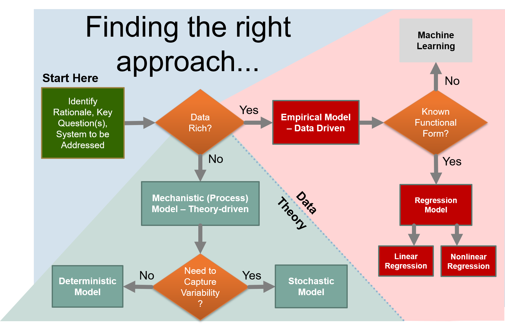

# Introduction to Mathematical Modeling for Biological and Ecological Systems

Author: John Bolte, Biological & Ecological Engineering Department, Oregon State University

In this module, we introduce basic concepts of mathematical modeling of biological and ecological systems, and introduce some language to describe different types of modeling approaches. 

We will start with a basic question:  **What is a model**.  A model is simply a representation of some aspect of reality.  Here, we are concerned with **mathematical models**, were the representation consists of one or more mathematical equations that generally relate one variable to one or more other variables to describe a process or relationship of interest.

**The role of data**.  Measurements (obervations) of the data you are trying to model is generally required to *parameterize* the model; meaning fitting a model to the observations by finding parameter values for the model that allow the model to "best" fit the data.

**Empirical Models** are models that are completely dependent on fitting the model to real observed data.  These type of models are appropriate where: 1) observed data for systems similar to the one you are trying to model exists, preferably in abundance, and 2) you do not have, or are not using, a theory-based description of the modeled phenomena, captured in your model equations.  These models are generally deveoped using **regression** techniques that automatically find "best-fit" parameters for a given datasets.  The techiques are discussed in the first two chapters of this module: [Linear Regression](../1-Linear-Regression/Linear-Regression.html) and [Nonlinear Regression](../2-Nonlinear-Regression/Nonlinear-Regression.html). 

In contrast, **Mechanistic Models** capture directly the theory of processes of interest, phenomena, expressed in appropriate mathematical forms.  Such models are frequently less data dependent, although data is still often necessary to paramerize these models. An example of a mechanistic model is:  $\large E = mc^2$, Einstein's famous equating relating the energy (E) contained in a given mass (m), where the relationship is given by the mass times the speed of light, squared.  Mechanistic modeling techniques are discussed in the following sections: [Mechanistic Modeling](../3-Mechanistic-Modeling/Mechanistic-Modeling.html) and [Multidimensional Models](../4-Multidimensional-Models.html) 

We will also address **Stochastic Models** - those models that capture underlying *variability* in the system of interest directly in the model.  Such models are useful when we are trying to understand the likelihood of observing specific outcomes; for example, in flood modeling, we might be primarliy concerned with *recurrence intervals* that indicate the probability of achieving particular flood stages, i.e. a "100 year flood". Techniques for stochastic modeling are described in the [Stochastic Modeling](../5-Stochastic-Models/Stochastic-Models.html) section.

Finally, we address the topic of model validation and testing, presenting techniques for assessing model quality and understanding sensitivity of the model to perturbations of inputs in the [Model Validation and Testing](../6-Model-Validation-and-Testing/Model-Validation-and-Testing.html) section. 

Bofore diving into details, let's consider three situations.

1. We want to predict the gas mileage of a car, based on the car's weight, and we have a datasets that contains a number of observations of car weights with corresponding gas milages.

2. We want to model the dynamics of a continuous flow biological reactor for growing algae, and we have both data and anderstanding of the theory of algal growth.

3. We want to estimate the likelihood of a crop failure in the face of variable precipiation  forecasts, as a way of hedging bets on crop success and/or determining supplementary irrigation requirements. 

In the first case, we would likely focus on developing an empirical model, since we have appropriate data and just need to fit a simple equation to the data.  In the second, a more mechanistic approach may be called for, reflecting both an understanding of the processes affecting algal growth and perhaps limited data availability. In the third case, because we are concerned with estimating probability of a given outcome, a stochastic model is called for.

The figure below provides a roadmap for use in selecting an appropriate modeling approach for a given situation.

